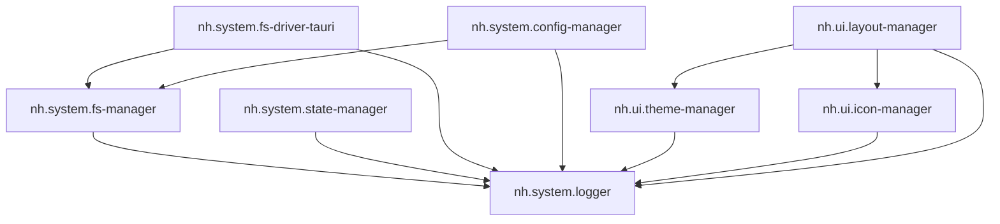

# Документация Notehub.md

## 📚 Содержание

### Архитектура и разработка

- [**Архитектура ядра**](./core-architecture.md) — Компоненты ядра: NotehubCore, EventBus, ApiBus
- [**Разработка плагинов**](./plugin-development.md) — Руководство по созданию плагинов
- [**CLI инструменты**](./cli-tools.md) — Описание команд и скриптов

### Системные плагины

- [**Logger**](./plugins/logger.md) — Централизованное логирование
- [**FS Manager**](./plugins/fs-manager.md) — Абстракция файловой системы
- [**FS Driver Tauri**](./plugins/fs-driver-tauri.md) — Реализация FS для Tauri v2
- [**State Manager**](./plugins/state-manager.md) — Реактивное хранилище состояния
- [**Config Manager**](./plugins/config-manager.md) — Управление настройками
- [**Bootloader**](./plugins/bootloader.md) — Оркестратор загрузки с разрешением зависимостей

### UI плагины

- [**Theme Manager**](./plugins/theme-manager.md) — CSS-переменные и темы
- [**Icon Manager**](./plugins/icon-manager.md) — Реестр иконок (Lucide)
- [**Layout Manager**](./plugins/layout-manager.md) — Система лейаутов

### Отчёты

- [2024-12-24: Инициализация проекта](./reports/2024-12-24-project-init.md)
- [2024-12-24: FS Layer](./reports/2024-12-24-fs-layer.md)
- [2024-12-24: Config Manager](./reports/2024-12-24-config-manager.md)
- [2024-12-24: UI Layer](./reports/2024-12-24-ui-layer.md)

---

## 🚀 Быстрый старт

```bash
# Установка
pnpm install

# Сборка всех пакетов
pnpm build

# Запуск Desktop приложения (Tauri)
pnpm dev:desktop

# Создание нового плагина
pnpm gen:plugin
```

## 📦 Структура проекта

```
notehub.md/
├── packages/
│   ├── core/                 # @notehub/core — ядро приложения
│   └── plugins/
│       ├── system/           # Системные плагины
│       │   ├── bootloader/   # Оркестратор загрузки
│       │   ├── logger/       # Централизованное логирование
│       │   ├── fs-manager/   # Абстракция файловой системы
│       │   ├── fs-driver-tauri/ # Tauri драйвер FS
│       │   ├── state-manager/   # Хранилище состояния
│       │   └── config-manager/  # Менеджер конфигурации
│       ├── ui/               # UI плагины
│       │   ├── theme-manager/   # Темы и CSS-переменные
│       │   ├── icon-manager/    # Реестр иконок
│       │   └── layout-manager/  # Система лейаутов
│       └── features/         # Фича-плагины
├── apps/
│   └── desktop/              # Tauri Desktop приложение
├── scripts/                  # CLI-скрипты
└── docs/                     # Документация
    └── ru/                   # Русская документация
```

## 🔌 Реестр плагинов

### Системные плагины

| Плагин | ID | Описание |
|--------|-----|----------|
| Logger | `nh.system.logger` | Централизованное логирование |
| FS Manager | `nh.system.fs-manager` | Абстракция файловой системы |
| FS Driver Tauri | `nh.system.fs-driver-tauri` | Реализация FS для Tauri v2 |
| State Manager | `nh.system.state-manager` | Реактивное хранилище состояния |
| Config Manager | `nh.system.config-manager` | Централизованное управление настройками |
| Bootloader | `nh.system.bootloader` | Оркестратор загрузки плагинов |

### UI плагины

| Плагин | ID | Описание |
|--------|-----|----------|
| Theme Manager | `nh.ui.theme-manager` | CSS-переменные и темы |
| Icon Manager | `nh.ui.icon-manager` | Реестр иконок на базе Lucide |
| Layout Manager | `nh.ui.layout-manager` | Система React-лейаутов |

## 🎨 Граф зависимостей


