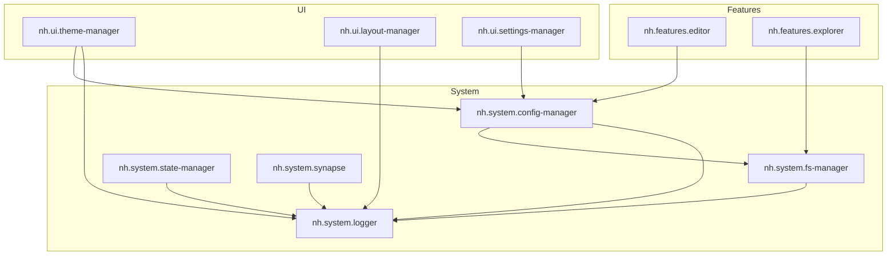

<h1 align="center">📚 Документация Notehub.md</h1>

<p align="center">
  <em>Техническая документация для разработчиков и контрибьюторов</em>
</p>

---

## 🗂 Содержание

### 📐 Архитектура и разработка

| Документ | Описание |
|----------|----------|
| [Архитектура ядра](./core-architecture.md) | NotehubCore, EventBus, ApiBus |
| [Разработка плагинов](./plugin-development.md) | Гайд по созданию плагинов |
| [CLI инструменты](./cli-tools.md) | Команды и скрипты |

### 🔌 Для разработчиков плагинов

| Язык | Ссылка |
|------|--------|
| 🇷🇺 Русский | **[Руководство разработчика плагинов](../forPluginMakers/ru/README.md)** |
| 🇬🇧 English | **[Plugin Developer Guide](../forPluginMakers/en/README.md)** |

---

## ⚙️ Системные плагины

| Плагин | ID | Описание |
|--------|-----|----------|
| [Logger](./plugins/logger.md) | `nh.system.logger` | Централизованное логирование |
| [FS Manager](./plugins/fs-manager.md) | `nh.system.fs-manager` | Абстракция файловой системы |
| [FS Driver Tauri](./plugins/fs-driver-tauri.md) | `nh.system.fs-driver-tauri` | Реализация FS для Tauri v2 |
| [State Manager](./plugins/state-manager.md) | `nh.system.state-manager` | Реактивное хранилище состояния |
| [Config Manager](./plugins/config-manager.md) | `nh.system.config-manager` | Управление настройками |
| [Bootloader](./plugins/bootloader.md) | `nh.system.bootloader` | Оркестратор загрузки |
| [Synapse](./plugins/synapse.md) | `nh.system.synapse` | Загрузчик внешних плагинов |

## 🎨 UI плагины

| Плагин | ID | Описание |
|--------|-----|----------|
| [Theme Manager](./plugins/theme-manager.md) | `nh.ui.theme-manager` | CSS-переменные и темы |
| [Icon Manager](./plugins/icon-manager.md) | `nh.ui.icon-manager` | Реестр иконок (Lucide) |
| [Layout Manager](./plugins/layout-manager.md) | `nh.ui.layout-manager` | Система лейаутов |
| Settings Manager | `nh.ui.settings-manager` | Модальное окно настроек |
| Dialog Manager | `nh.ui.dialog-manager` | Диалоги (alert, confirm, prompt) |
| Context Menu | `nh.ui.context-menu` | Контекстные меню |

## 🚀 Фича-плагины

| Плагин | ID | Описание |
|--------|-----|----------|
| Editor | `nh.features.editor` | Markdown редактор на CodeMirror 6 |
| Explorer | `nh.features.explorer` | Файловый проводник |
| Backlinks | `nh.features.backlinks` | Панель обратных ссылок |
| Vault Picker | `nh.features.vault-picker` | Выбор хранилища |

---

## 🚀 Быстрый старт

```bash
# Установка зависимостей
pnpm install

# Сборка всех пакетов
pnpm build

# Запуск Desktop приложения (Tauri)
pnpm dev:desktop

# Создание нового плагина
pnpm gen:plugin
```

---

## 📦 Структура проекта

```
notehub.md/
├── packages/
│   ├── core/                    # @notehub/core — ядро приложения
│   ├── api/                     # @notehub/api — SDK для плагинов
│   └── plugins/
│       ├── system/              # Системные плагины
│       │   ├── bootloader/      # Оркестратор загрузки
│       │   ├── logger/          # Централизованное логирование
│       │   ├── synapse/         # Загрузчик внешних плагинов
│       │   └── ...
│       ├── ui/                  # UI плагины
│       │   ├── theme-manager/   # Темы и CSS-переменные
│       │   ├── settings-manager/# Настройки
│       │   └── ...
│       └── features/            # Фича-плагины
│           ├── editor/          # Markdown редактор
│           ├── explorer/        # Файловый проводник
│           └── ...
├── apps/
│   └── desktop/                 # Tauri Desktop приложение
├── docs/
│   ├── ru/                      # Русская документация
│   └── forPluginMakers/         # Документация для разработчиков плагинов
│       ├── en/                  # English
│       └── ru/                  # Русский
└── scripts/                     # CLI-скрипты
```

---

## 🎨 Граф зависимостей



---

## 📋 Отчёты и история

### 2026
- [2026-01-12: Design Revamp](./reports/2026-01-12-design-revamp.md)

### 2024
- [2024-12-24: Инициализация проекта](./reports/2024-12-24-project-init.md)
- [2024-12-24: FS Layer](./reports/2024-12-24-fs-layer.md)
- [2024-12-24: Config Manager](./reports/2024-12-24-config-manager.md)
- [2024-12-24: UI Layer](./reports/2024-12-24-ui-layer.md)
