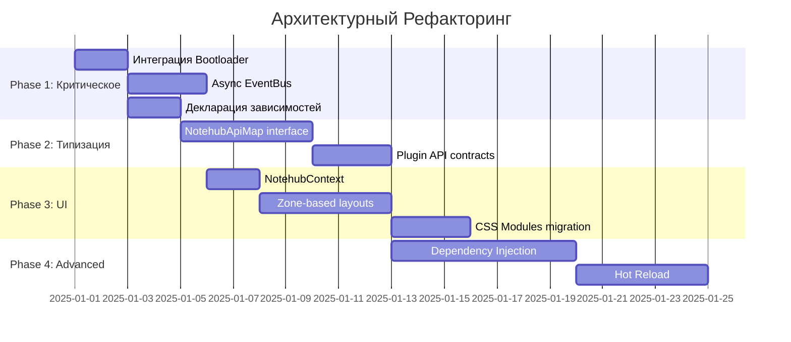

# Глобальный Аудит Системы Notehub.md

**Дата:** 2024-12-25  
**Версия:** 1.0

---

## Содержание

1. [Резюме](#резюме)
2. [Архитектурный Обзор](#архитектурный-обзор)
3. [Бутылочные Горлышки и Оптимизация](#бутылочные-горлышки-и-оптимизация)
4. [Экосистема Плагинов](#экосистема-плагинов)
5. [UI Слой](#ui-слой)
6. [Философия Взаимодействия Плагинов](#философия-взаимодействия-плагинов)
7. [Рекомендации](#рекомендации)

---

## Резюме

Проект Notehub.md построен на **микроядерной архитектуре** с центральным ядром (`NotehubCore`) и модульной системой плагинов. Анализ выявил несколько критических областей для улучшения:

| Категория | Статус | Приоритет |
|-----------|--------|-----------|
| Производительность инициализации | ⚠️ Требует внимания | Высокий |
| API типизация | ⚠️ Слабая | Средний |
| Event Bus | ⚠️ Синхронный | Высокий |
| Зависимости плагинов | ⚠️ Неявные | Средний |
| UI компоненты | ⚠️ Inline стили | Низкий |
| Состояние плагинов | ⚠️ Глобальные синглтоны | Высокий |

---

## Архитектурный Обзор

### Ядро Системы

```
┌─────────────────────────────────────────────────────────────┐
│                      NotehubCore                             │
├─────────────────────────────────────────────────────────────┤
│  EventBus (pub/sub)  │  ApiBus (RPC)  │  Plugin Registry   │
└─────────────────────────────────────────────────────────────┘
                              │
        ┌─────────────────────┼─────────────────────┐
        │                     │                     │
   ┌────▼────┐          ┌────▼────┐          ┌────▼────┐
   │ System  │          │   UI    │          │ Feature │
   │ Plugins │          │ Plugins │          │ Plugins │
   └─────────┘          └─────────┘          └─────────┘
```

### Текущая Иерархия Слоёв

```
Layer 0: Logger (фундамент логирования)
Layer 1: FsManager, StateManager (инфраструктура)
Layer 2: FsDriverTauri, ConfigManager (драйверы и сервисы)
Layer 3: ThemeManager, IconManager, ControllersManager, CKStandard, DialogManager (UI основа)
Layer 4: LayoutManager, VaultPicker, Workbench, Explorer (приложение)
```

### Ключевые Компоненты

| Компонент | Назначение | Файл |
|-----------|------------|------|
| `EventBus` | Pub/Sub для межплагинной коммуникации | `packages/core/src/buses/EventBus.ts` |
| `ApiBus` | RPC регистр для прямых вызовов методов | `packages/core/src/buses/ApiBus.ts` |
| `Bootloader` | Оркестрация загрузки с топологической сортировкой | `packages/plugins/system/bootloader/src/Bootloader.ts` |

---

## Бутылочные Горлышки и Оптимизация

### 🔴 Критические Проблемы

#### 1. **Синхронный EventBus**

```typescript
// Текущая реализация (EventBus.ts:69-79)
emit<K extends keyof TEvents>(event: K, payload?: TEvents[K]): void {
    const callbacks = this.listeners.get(event);
    if (callbacks) {
        for (const callback of callbacks) {
            try {
                callback(payload); // ← БЛОКИРУЮЩИЙ ВЫЗОВ
            } catch (error) {
                console.error(`[EventBus] Error...`);
            }
        }
    }
}
```

> [!CAUTION]
> **Проблема:** Если один подписчик выполняет долгую операцию, все последующие подписчики блокируются. Это создаёт каскадные задержки при загрузке плагинов.

**Рекомендация:**
```typescript
async emitAsync<K extends keyof TEvents>(event: K, payload?: TEvents[K]): Promise<void> {
    const callbacks = this.listeners.get(event);
    if (callbacks) {
        await Promise.allSettled(
            Array.from(callbacks).map(cb => Promise.resolve(cb(payload)))
        );
    }
}
```

---

#### 2. **Отсутствие Типизации ApiBus**

```typescript
// Текущая реализация (ApiBus.ts:62-68)
async invoke<TResult>(name: string, ...args: unknown[]): Promise<TResult> {
    const handler = this.handlers.get(name);
    if (!handler) {
        throw new Error(`[ApiBus] Handler "${name}" is not registered`);
    }
    return handler(...args) as Promise<TResult>; // ← UNSAFE CAST
}
```

> [!WARNING]  
> **Проблема:** Строковые ключи для API (`'logger:info'`, `'config:get'`) не типизированы. Опечатки не обнаруживаются до runtime.

**Рекомендация:** Создать глобальную карту API-типов:

```typescript
interface NotehubApiMap {
    'logger:info': (source: string, message: string) => void;
    'config:get': <T>(key: string, defaultValue?: T) => Promise<T | undefined>;
    'layout:set': (name: string, props?: Record<string, unknown>) => boolean;
}

// Типизированный invoke
invoke<K extends keyof NotehubApiMap>(
    name: K, 
    ...args: Parameters<NotehubApiMap[K]>
): ReturnType<NotehubApiMap[K]>;
```

---

#### 3. **Последовательная Загрузка в NotehubCore**

```typescript
// Текущая реализация (index.ts:108-117)
for (const [id, plugin] of this.plugins) {
    try {
        console.log(`[NotehubCore] Loading plugin "${id}"...`);
        await plugin.load(this); // ← ПОСЛЕДОВАТЕЛЬНО
        console.log(`[NotehubCore] Plugin "${id}" loaded successfully`);
    } catch (error) {
        // ...
    }
}
```

> [!IMPORTANT]
> **Проблема:** Хотя `Bootloader` поддерживает параллельную загрузку волнами (`wavefront`), сам `NotehubCore.init()` загружает плагины строго последовательно.

**Текущий путь:**
```
main.tsx → core.registerPlugin(×15) → core.init() → последовательный load()
```

**Bootloader не используется!** В `main.tsx:79`:
```typescript
new Bootloader(core); // ← Создаётся, но не вызывается .load()
```

---

#### 4. **Глобальное Состояние в Модулях**

Несколько плагинов используют **module-level state**, что создаёт проблемы:

```typescript
// layout-manager/src/index.tsx (строки 22-28)
const layoutRegistry = new Map<string, LayoutComponent>(); // ГЛОБАЛЬНО
let activeLayout: ActiveLayout | null = null;              // ГЛОБАЛЬНО
const subscribers = new Set<() => void>();                 // ГЛОБАЛЬНО
```

```typescript
// controllers-manager/src/index.tsx (строка 17)
let controllerRegistryInstance: Map<string, React.FC<any>> | null = null; // ГЛОБАЛЬНО
```

> [!WARNING]
> **Проблемы:**
> - Невозможен Hot Module Replacement (HMR) без утечек
> - Состояние сохраняется между тестами
> - Нельзя создать несколько экземпляров ядра

---

### 🟡 Средние Проблемы

#### 5. **Отсутствие Версионирования API**

Плагины регистрируют API без семантического версионирования:

```typescript
app.api.register('theme:set', this.handleSet);
```

При изменении сигнатуры `handleSet` все зависимые плагины сломаются без предупреждения.

**Рекомендация:**
```typescript
interface ApiDefinition {
    handler: ApiHandler;
    version: string;
    deprecated?: boolean;
}
```

---

#### 6. **Отсутствие Lazy Loading**

Все плагины импортируются статически в `main.tsx`:

```typescript
import { LoggerPlugin } from '@notehub/logger';
import { FsManagerPlugin } from '@notehub/fs-manager';
// ... 15+ импортов
```

> [!NOTE]
> **Проблема:** Увеличивает initial bundle size и время до первого рендера.

**Рекомендация:** Динамический импорт для feature-плагинов:
```typescript
const ExplorerPlugin = await import('@notehub/explorer');
```

---

## Экосистема Плагинов

### Текущая Структура

| Категория | Количество | Плагины |
|-----------|------------|---------|
| System | 6 | `logger`, `fs-manager`, `state-manager`, `config-manager`, `fs-driver-tauri`, `bootloader` |
| UI | 6 | `theme-manager`, `icon-manager`, `controllers-manager`, `ck-standard`, `dialog-manager`, `layout-manager` |
| Features | 3 | `vault-picker`, `workbench`, `explorer` |

### 🔴 Проблемы Зависимостей

#### Неявные Зависимости

Многие плагины вызывают API других плагинов **без объявления зависимости**:

```typescript
// theme-manager/src/index.ts (строка 121-122)
private log(level: 'info' | 'warn' | 'error', message: string): void {
    if (this.app) {
        this.app.api.invoke(`logger:${level}`, ...); // ← НЕЯВНАЯ ЗАВИСИМОСТЬ
    }
}
```

Но в `manifest.json` нет:
```json
{
  "dependencies": ["nh.system.logger"] // ОТСУТСТВУЕТ
}
```

**Выявленные неявные зависимости:**

| Плагин | Вызывает | Объявлено? |
|--------|----------|------------|
| `theme-manager` | `logger:*`, `config:*` | ❌ Нет |
| `layout-manager` | `logger:*` | ❌ Нет |
| `ck-standard` | `controller:register`, `logger:*` | ❌ Нет |
| `vault-picker` | `controller:register`, `layout:set`, `state:*`, `config:*` | ❌ Нет |
| `explorer` | `controller:register` | ❌ Нет |

---

#### Отсутствие Контракта API

Плагины используют строковые ключи без гарантий:

```typescript
// vault-picker вызывает
app.api.invoke('controller:register', 'vault-list', VaultListWrapper);

// Если controllers-manager не загружен — runtime error
```

**Рекомендация:** Проверка доступности API перед вызовом:

```typescript
if (app.api.has('controller:register')) {
    await app.api.invoke('controller:register', ...);
} else {
    this.log('warn', 'ControllersManager not available');
}
```

---

### 🟡 Отсутствие Lifecycle Hooks

Текущий интерфейс плагина минималистичен:

```typescript
interface IPlugin {
    readonly manifest: PluginManifest;
    load(app: any): Promise<void> | void;
    unload(app: any): Promise<void> | void;
}
```

**Отсутствуют:**
- `onReady()` — после загрузки всех плагинов
- `onBeforeUnload()` — для graceful shutdown
- `onDependencyLoaded(id)` — для реактивной инициализации

---

## UI Слой

### Архитектура

```
┌─────────────────────────────────────────────────────────────┐
│                     LayoutRenderer                           │
│  (useSyncExternalStore для reactive updates)                 │
├─────────────────────────────────────────────────────────────┤
│  Layout Registry: Map<string, React.FC>                      │
│  - 'welcome' → WelcomeLayout                                │
│  - 'editor' → EditorLayout                                  │
└─────────────────────────────────────────────────────────────┘
                              │
        ┌─────────────────────┼─────────────────────┐
        │                     │                     │
   ┌────▼────┐          ┌────▼────┐          ┌────▼────┐
   │ Theme   │          │  Icon   │          │Controller│
   │ Manager │          │ Manager │          │ Manager  │
   └─────────┘          └─────────┘          └──────────┘
```

### 🔴 Проблемы

#### 1. **Inline Стили vs CSS**

Компоненты `ck-standard` используют inline стили:

```typescript
// Button.tsx
const baseStyle: React.CSSProperties = {
    display: 'inline-flex',
    alignItems: 'center',
    justifyContent: 'center',
    // ... 20+ свойств
};
```

> [!WARNING]
> **Проблемы:**
> - Невозможна кастомизация через CSS
> - Дублирование стилей в каждом инстансе
> - Нет поддержки медиа-запросов

---

#### 2. **Отсутствие Композиции Лейаутов**

Лейауты регистрируются как монолитные компоненты:

```typescript
this.handleRegisterComponent('welcome', WelcomeLayout);
this.handleRegisterComponent('editor', EditorLayout);
```

Нет возможности **вложенных лейаутов** или **зон**:

```typescript
// ЖЕЛАЕМОЕ
<Layout name="editor">
    <Zone name="sidebar" />     ← ExplorerPlugin регистрирует контент
    <Zone name="main" />        ← EditorPlugin регистрирует контент
    <Zone name="status-bar" />  ← StatusBarPlugin регистрирует контент
</Layout>
```

---

#### 3. **Prop Drilling App Instance**

`LayoutRenderer` передаёт `app` через props:

```typescript
// layout-manager/src/index.tsx:95
return <Component {...currentLayout.props} app={appInstance} />;
```

Это требует от каждого лейаута явного пробрасывания `app` вглубь дерева.

**Рекомендация:** React Context:

```typescript
const NotehubContext = React.createContext<NotehubCore | null>(null);

export const useNotehub = () => {
    const app = useContext(NotehubContext);
    if (!app) throw new Error('NotehubContext not available');
    return app;
};
```

---

## Философия Взаимодействия Плагинов

### Текущая Модель

```
                    ┌───────────────┐
                    │   NotehubCore │
                    │   (Mediator)  │
                    └───────┬───────┘
                            │
        ┌───────────────────┼───────────────────┐
        │                   │                   │
   ┌────▼────┐         ┌────▼────┐         ┌────▼────┐
   │ Plugin A │◄───────│ EventBus │───────►│ Plugin B │
   │          │        │  ApiBus  │        │          │
   └──────────┘        └──────────┘        └──────────┘
```

**Плагины общаются только через ядро** — это правильно для микроядра.

### Что Должно Работать (но не работает)

#### 1. **Декларативные Зависимости**

Плагин **должен** объявлять все API, которые он использует:

```json
{
  "id": "nh.ui.theme-manager",
  "dependencies": ["nh.system.logger", "nh.system.config-manager"],
  "optionalDependencies": ["nh.ui.icon-manager"]
}
```

Bootloader **должен** валидировать доступность API после загрузки плагина.

---

#### 2. **Контракт API**

Каждый плагин **должен** экспортировать интерфейс своего API:

```typescript
// @notehub/logger/types.ts
export interface LoggerApi {
    'logger:info': (source: string, message: string) => void;
    'logger:warn': (source: string, message: string) => void;
    'logger:error': (source: string, message: string) => void;
}
```

Потребители **должны** импортировать типы:

```typescript
import type { LoggerApi } from '@notehub/logger';
```

---

#### 3. **Event-Driven Integration**

Вместо прямых вызовов `api.invoke()` для интеграции feature-плагинов:

```typescript
// ❌ ТЕКУЩИЙ ПОДХОД
app.api.invoke('layout:set', 'editor');

// ✅ РЕКОМЕНДУЕМЫЙ ПОДХОД
app.events.emit('app:phase-changed', { phase: 'editor' });
// LayoutManager слушает событие и сам переключает лейаут
```

**Преимущества:**
- Плагины не знают о существовании друг друга
- Легко добавить новые реакции на события
- Проще тестировать изолированно

---

#### 4. **Зоны UI**

Feature-плагины **должны** регистрировать контент в **именованные зоны**, а не напрямую в `controller:register`:

```typescript
// ❌ ТЕКУЩИЙ ПОДХОД
app.api.invoke('controller:register', 'explorer-tree', ExplorerTreeComponent);

// ✅ РЕКОМЕНДУЕМЫЙ ПОДХОД
app.api.invoke('zone:register', {
    zone: 'left-sidebar',
    component: ExplorerTreeComponent,
    priority: 100,
    visible: true
});
```

---

## Рекомендации

### Высокий Приоритет

| # | Рекомендация | Сложность | Влияние |
|---|--------------|-----------|---------|
| 1 | Использовать Bootloader в `main.tsx` вместо `core.init()` | Низкая | Высокое |
| 2 | Добавить async-версию `EventBus.emit()` | Средняя | Высокое |
| 3 | Объявить все зависимости в `manifest.json` | Низкая | Среднее |
| 4 | Создать React Context для `NotehubCore` | Низкая | Среднее |

### Средний Приоритет

| # | Рекомендация | Сложность | Влияние |
|---|--------------|-----------|---------|
| 5 | Типизировать ApiBus с глобальной картой API | Высокая | Высокое |
| 6 | Реализовать систему зон для UI | Средняя | Среднее |
| 7 | Добавить lifecycle hooks (`onReady`, `onBeforeUnload`) | Средняя | Среднее |
| 8 | Перенести стили из inline в CSS-модули | Средняя | Низкое |

### Низкий Приоритет

| # | Рекомендация | Сложность | Влияние |
|---|--------------|-----------|---------|
| 9 | Lazy loading для feature-плагинов | Средняя | Низкое |
| 10 | API версионирование | Высокая | Низкое |
| 11 | Вложенные лейауты | Высокая | Низкое |

---

## Заключение

Архитектура Notehub.md имеет **прочный фундамент** микроядерного подхода, но требует доработки в областях:

1. **Производительность** — использовать Bootloader для параллельной загрузки
2. **Типобезопасность** — типизировать API-контракты
3. **Изоляция** — устранить глобальное состояние в модулях
4. **Расширяемость** — добавить систему зон для UI

Следующий шаг — создание RFC для рефакторинга критических компонентов.

---

## Расширенные Архитектурные Рекомендации

### 🧠 Паттерны и Практики

#### 1. **Inversion of Control (IoC) Container**

Текущий подход — ручная регистрация плагинов в `main.tsx`:

```typescript
core.registerPlugin(new LoggerPlugin());
core.registerPlugin(new FsManagerPlugin());
// ... 15 строк
```

**Рекомендация:** Автоматическое обнаружение плагинов:

```typescript
// plugin-registry.json (генерируется scripts/link-plugins.ts)
[
  { "id": "nh.system.logger", "entry": "@notehub/logger" },
  { "id": "nh.system.fs-manager", "entry": "@notehub/fs-manager" }
]

// main.tsx
const registry = await import('./generated/plugin-registry.json');
for (const pluginDef of registry) {
    const PluginClass = (await import(pluginDef.entry)).default;
    core.registerPlugin(new PluginClass());
}
```

---

#### 2. **Dependency Injection для Плагинов**

Вместо доступа к `app.api.invoke()` внутри плагинов — инжектировать зависимости:

```typescript
// ТЕКУЩИЙ ПОДХОД
class ThemeManagerPlugin {
    async load(app: NotehubCore) {
        const savedTheme = await app.api.invoke('config:get', 'theme.current');
    }
}

// РЕКОМЕНДУЕМЫЙ ПОДХОД
class ThemeManagerPlugin {
    constructor(
        private config: ConfigManagerApi, // Инжектируется
        private logger: LoggerApi         // Инжектируется
    ) {}

    async load() {
        const savedTheme = await this.config.get('theme.current');
    }
}
```

**Bootloader** резолвит зависимости и инжектирует их при создании плагина.

---

#### 3. **Circuit Breaker для API**

Защита от каскадных отказов при вызове API:

```typescript
class ResilientApiBus extends ApiBus {
    private failures = new Map<string, number>();
    private threshold = 3;
    
    async invoke<T>(name: string, ...args: unknown[]): Promise<T> {
        if (this.failures.get(name) >= this.threshold) {
            throw new Error(`Circuit open for ${name}`);
        }
        
        try {
            return await super.invoke(name, ...args);
        } catch (error) {
            this.failures.set(name, (this.failures.get(name) || 0) + 1);
            throw error;
        }
    }
}
```

---

### 🧪 Стратегия Тестирования

#### 1. **Unit Tests для Плагинов**

Каждый плагин должен иметь изолированные тесты:

```typescript
// __tests__/theme-manager.test.ts
describe('ThemeManagerPlugin', () => {
    let plugin: ThemeManagerPlugin;
    let mockApp: MockNotehubCore;

    beforeEach(() => {
        mockApp = createMockCore();
        plugin = new ThemeManagerPlugin();
    });

    it('registers API methods on load', async () => {
        await plugin.load(mockApp);
        
        expect(mockApp.api.register).toHaveBeenCalledWith(
            'theme:set',
            expect.any(Function)
        );
    });
});
```

---

#### 2. **Integration Tests для Слоёв**

Тестирование взаимодействия плагинов внутри слоя:

```
Layer 3 Tests:
  ✓ ThemeManager applies CSS variables
  ✓ IconManager renders fallback for unknown icons
  ✓ ControllersManager provides Controller component
  ✓ CKStandard registers all 6 controllers
```

---

#### 3. **E2E Tests для Критических Путей**

```typescript
// e2e/vault-flow.spec.ts
test('User can create and open vault', async ({ page }) => {
    await page.goto('/');
    await page.click('[data-testid="create-vault"]');
    await page.fill('[data-testid="vault-name"]', 'Test Vault');
    await page.click('[data-testid="confirm"]');
    
    await expect(page.locator('[data-testid="editor-layout"]')).toBeVisible();
});
```

---

### 🔮 Future-Proofing

#### 1. **Plugin Federation (Microfrontends)**

Для масштабирования — загрузка плагинов как независимых модулей:

```typescript
// webpack.config.js (Module Federation)
new ModuleFederationPlugin({
    name: 'host',
    remotes: {
        explorerPlugin: 'explorer@http://localhost:3001/remoteEntry.js',
    },
});

// Динамическая загрузка
const ExplorerPlugin = await import('explorerPlugin/ExplorerPlugin');
```

---

#### 2. **Plugin Marketplace**

Инфраструктура для сторонних плагинов:

```yaml
# plugin.manifest.yaml
id: community.markdown-preview
name: Markdown Preview
author: Community
version: 1.0.0
permissions:
  - fs:read
  - ui:register-zone
repository: https://github.com/...
signature: <cryptographic-signature>
```

---

#### 3. **Hot Reload для Плагинов**

Перезагрузка плагинов без перезапуска приложения:

```typescript
async reloadPlugin(pluginId: string): Promise<void> {
    const plugin = this.plugins.get(pluginId);
    if (!plugin) return;
    
    // 1. Сохранить состояние
    const state = await plugin.serialize?.();
    
    // 2. Выгрузить
    await plugin.unload(this);
    
    // 3. Очистить кэш модуля
    delete require.cache[plugin.modulePath];
    
    // 4. Загрузить заново
    const NewPlugin = require(plugin.modulePath).default;
    const newInstance = new NewPlugin();
    
    // 5. Восстановить состояние
    await newInstance.load(this);
    await newInstance.deserialize?.(state);
    
    this.plugins.set(pluginId, newInstance);
}
```

---

#### 4. **Observability**

Встроенные метрики и трейсинг:

```typescript
interface PluginMetrics {
    loadTime: number;
    apiCallCount: number;
    eventEmitCount: number;
    errors: Error[];
}

// DevTools integration
app.api.invoke('devtools:get-metrics', 'nh.ui.theme-manager');
```

---

### 🏗️ Рефакторинг Roadmap



---

### 📋 Checklist для Новых Плагинов

Перед мержем нового плагина проверить:

- [ ] `manifest.json` содержит все зависимости (включая `logger`)
- [ ] Нет прямых вызовов `console.log` (использовать `logger:*`)
- [ ] Нет module-level state (состояние внутри класса)
- [ ] `unload()` корректно очищает все ресурсы
- [ ] API методы зарегистрированы с уникальными именами
- [ ] События эмитятся с namespace (`plugin-name:event`)
- [ ] Есть unit-тесты для load/unload lifecycle
- [ ] README.md документирует API и события

---

> **Автор:** Claude (AI Assistant)  
> **Сгенерировано:** 2024-12-25  
> **Обновлено:** 2024-12-26
