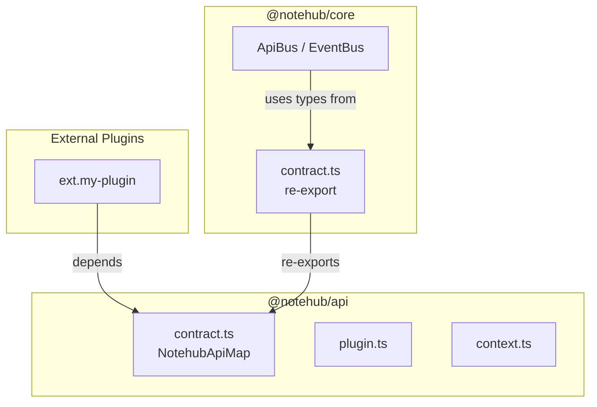

# API Рефакторинг: Миграция публичного контракта

**Дата:** 2026-01-04
**Автор:** Antigravity AI
**RC3: Wave 3 — Total Ecosystem Exposure**

---

## Введение

В рамках RC3 Wave 3 была проведена масштабная работа по экспонированию всех внутренних API для внешних плагинов. Цель — обеспечить 100% покрытие типами всех доступных методов API.

### Проблема

До рефакторинга интерфейс `NotehubApiMap` (определение всех доступных API-методов) находился в `@notehub/core`. Это делало его недоступным для внешних плагинов, которые зависят от `@notehub/api`, а не от `core`.

### Решение

Применён паттерн **Dependency Inversion** — типы перенесены в публичный SDK (`@notehub/api`), а `@notehub/core` теперь импортирует их оттуда. Это безопасно архитектурно, так как `core` уже зависит от `api`.

---

## Миграция файлов

### Изменённые файлы

| Файл | Действие | Описание |
|------|----------|----------|
| `packages/api/src/contract.ts` | **[NEW]** | Новый файл с полным определением `NotehubApiMap` и всех сопутствующих типов |
| `packages/api/src/index.ts` | **[MODIFY]** | Добавлен экспорт `contract.ts` |
| `packages/api/package.json` | **[MODIFY]** | Добавлены `@types/react` и `peerDependencies` |
| `packages/core/src/api/contract.ts` | **[MODIFY]** | Заменён на реэкспорт из `@notehub/api` |
| `packages/core/package.json` | **[MODIFY]** | Добавлена зависимость `@notehub/api` |

### Архитектурная диаграмма



---

## Аудит API (Полный список)

### Сводка по категориям

| Категория | Количество методов | Статус |
|-----------|-------------------|--------|
| **System** | 26 | ✅ Полное покрытие |
| **UI** | 24 | ✅ Полное покрытие |
| **Features** | 5 | ✅ Полное покрытие |

---

### 1. Системные плагины (`nh.system.*`)

#### Logger (`nh.system.logger`)

| Метод | Сигнатура | Статус |
|-------|-----------|--------|
| `logger:log` | `(level: string, source: string, message: string) => void` | ✅ Был |
| `logger:info` | `(source: string, message: string) => void` | ✅ Был |
| `logger:warn` | `(source: string, message: string) => void` | ✅ Был |
| `logger:error` | `(source: string, message: string) => void` | ✅ Был |

#### Config Manager (`nh.system.config-manager`)

| Метод | Сигнатура | Статус |
|-------|-----------|--------|
| `config:get` | `<T>(key: string, defaultValue?: T) => T \| undefined` | ✅ Был |
| `config:set` | `(key: string, value: unknown) => Promise<void>` | ✅ Был |
| `config:reload` | `() => Promise<void>` | ✅ Был |
| `config:delete` | `(key: string) => Promise<void>` | ✅ Был |

#### State Manager (`nh.system.state-manager`)

| Метод | Сигнатура | Статус |
|-------|-----------|--------|
| `state:set` | `(key: string, value: unknown) => void` | ✅ Был |
| `state:get` | `<T>(key: string) => T \| undefined` | ✅ Был |
| `state:delete` | `(key: string) => boolean` | ✅ Был |
| `state:has` | `(key: string) => boolean` | ✅ Был |
| `state:keys` | `() => string[]` | ✅ Был |
| `state:clear` | `() => void` | ✅ Был |
| `state:dump` | `() => Record<string, unknown>` | ✅ Был |
| `state:restore` | `(dump: Record<string, unknown>) => void` | ✅ Был |

#### FS Manager (`nh.system.fs-manager`)

| Метод | Сигнатура | Статус |
|-------|-----------|--------|
| `fs:register-driver` | `(driver: IFileSystem, name?: string) => void` | ✅ Был |
| `fs:read-file` | `(path: string) => Promise<Uint8Array>` | ✅ Был |
| `fs:read-text-file` | `(path: string) => Promise<string>` | ✅ Был |
| `fs:write-file` | `(path: string, data: Uint8Array) => Promise<void>` | ✅ Был |
| `fs:write-text-file` | `(path: string, content: string) => Promise<void>` | ✅ Был |
| `fs:create-dir` | `(path: string, options?: CreateDirOptions) => Promise<void>` | ✅ Был |
| `fs:read-dir` | `(path: string) => Promise<DirEntry[]>` | ✅ Был |
| `fs:exists` | `(path: string) => Promise<boolean>` | ✅ Был |
| `fs:pick-directory` | `() => Promise<string \| null>` | ✅ Был |
| `fs:watch` | `(path: string, onChange: (event: FsEvent) => void) => Promise<() => void>` | ✅ Был |
| `fs:remove-file` | `(path: string) => Promise<void>` | ✅ Был |
| `fs:remove-dir` | `(path: string, options?: { recursive?: boolean }) => Promise<void>` | ✅ Был |
| `fs:rename` | `(oldPath: string, newPath: string) => Promise<void>` | ✅ Был |

#### Bootloader (`nh.system.bootloader`)

| Метод | Сигнатура | Статус |
|-------|-----------|--------|
| `bootloader.load` | `(plugins: unknown[]) => Promise<unknown>` | ✅ Был |
| `bootloader.getResult` | `() => unknown \| null` | ✅ Был |
| `bootloader.getInstance` | `() => unknown \| null` | ✅ Был |

#### Synapse (`nh.system.synapse`)

| Метод | Сигнатура | Статус |
|-------|-----------|--------|
| `synapse:load-plugin` | `(pluginPath: string) => Promise<SynapseLoadResult>` | ⭐ **НОВЫЙ** |
| `synapse:unload-plugin` | `(pluginId: string) => Promise<boolean>` | ⭐ **НОВЫЙ** |
| `synapse:list-plugins` | `() => string[]` | ⭐ **НОВЫЙ** |

---

### 2. UI плагины (`nh.ui.*`)

#### Layout Manager (`nh.ui.layout-manager`)

| Метод | Сигнатура | Статус |
|-------|-----------|--------|
| `layout:register-component` | `(name: string, component: FC<Record<string, unknown>>) => void` | ✅ Был |
| `layout:set` | `(name: string, props?: Record<string, unknown>) => boolean` | ✅ Был |
| `layout:get-active` | `() => ActiveLayout \| null` | ✅ Был |
| `layout:list` | `() => string[]` | ✅ Был |
| `zone:register` | `(zoneId: string, item: ZoneItem) => void` | ✅ Был |
| `zone:get` | `(zoneId: string) => ZoneItem[]` | ✅ Был |
| `zone:clear` | `(zoneId: string) => void` | ✅ Был |

#### Controllers Manager (`nh.ui.controllers-manager`)

| Метод | Сигнатура | Статус |
|-------|-----------|--------|
| `controller:register` | `(name: string, component: FC<unknown>) => void` | ✅ Был |
| `controller:unregister` | `(name: string) => boolean` | ✅ Был |
| `controller:get` | `(name: string) => FC<unknown> \| undefined` | ✅ Был |

#### Dialog Manager (`nh.ui.dialog-manager`)

| Метод | Сигнатура | Статус |
|-------|-----------|--------|
| `dialog:alert` | `(title: string, message: string) => Promise<void>` | ✅ Был |
| `dialog:confirm` | `(title: string, message: string) => Promise<boolean>` | ✅ Был |
| `dialog:prompt` | `(title: string, message: string, defaultValue?: string) => Promise<string \| null>` | ✅ Был |

#### Theme Manager (`nh.ui.theme-manager`)

| Метод | Сигнатура | Статус |
|-------|-----------|--------|
| `theme:register` | `(name: string, palette: ThemePalette) => void` | ✅ Был |
| `theme:set` | `(name: string) => Promise<boolean>` | ✅ Был |
| `theme:get-current` | `() => string` | ✅ Был |
| `theme:list` | `() => string[]` | ✅ Был |
| `theme:get` | `(name: string) => ThemePalette \| undefined` | ✅ Был |

#### Icon Manager (`nh.ui.icon-manager`)

| Метод | Сигнатура | Статус |
|-------|-----------|--------|
| `icon:register` | `(name: string, component: React.ElementType) => void` | ✅ Был |
| `icon:get` | `(name: string) => React.ElementType` | ✅ Был |

#### Context Menu (`nh.ui.context-menu`)

| Метод | Сигнатура | Статус |
|-------|-----------|--------|
| `context-menu:register` | `(contextId: string, provider: MenuProvider) => () => void` | ⭐ **НОВЫЙ** |
| `context-menu:trigger` | `(event: MouseEvent, contextId: string, payload: unknown) => Promise<void>` | ⭐ **НОВЫЙ** |

#### Settings Manager (`nh.ui.settings-manager`)

| Метод | Сигнатура | Статус |
|-------|-----------|--------|
| `settings:register-tab` | `(tab: SettingsTabDef) => void` | ✅ Был |
| `settings:register-group` | `(group: SettingsGroupDef) => void` | ✅ Был |
| `settings:register-item` | `(item: SettingsItemDef) => void` | ✅ Был |
| `settings:register-tabs` | `(tabs: SettingsTabDef[]) => void` | ✅ Был |
| `settings:register-groups` | `(groups: SettingsGroupDef[]) => void` | ✅ Был |
| `settings:register-items` | `(items: SettingsItemDef[]) => void` | ✅ Был |
| `settings:get-structure` | `() => unknown` | ✅ Был |
| `settings:open` | `() => void` | ✅ Был |
| `settings:close` | `() => void` | ✅ Был |
| `settings:toggle` | `() => void` | ✅ Был |

---

### 3. Feature плагины (`nh.features.*`)

#### Explorer (`nh.features.explorer`)

| Метод | Сигнатура | Статус |
|-------|-----------|--------|
| `explorer:open` | `(path: string) => Promise<void>` | ✅ Был |
| `explorer:set-root` | `(path: string) => Promise<void>` | ✅ Был |

#### Vault Picker (`nh.features.vault-picker`)

| Метод | Сигнатура | Статус |
|-------|-----------|--------|
| `vault:close` | `() => Promise<void>` | ✅ Был |

---

## Новые типы

В рамках аудита были добавлены следующие типы, ранее отсутствовавшие в контракте:

### Context Menu Types

```typescript
export type MenuItemType = 'action' | 'submenu' | 'separator';

export interface MenuAction {
    type: 'action';
    id: string;
    label: string;
    icon?: string;
    color?: string;
    disabled?: boolean;
    onClick: (payload: unknown) => void;
}

export interface MenuSeparator {
    type: 'separator';
}

export interface SubMenu {
    type: 'submenu';
    label: string;
    icon?: string;
    items: MenuItem[];
}

export type MenuItem = MenuAction | MenuSeparator | SubMenu;
export type MenuProvider = (payload: unknown) => MenuItem[] | Promise<MenuItem[]>;
```

### Synapse Types

```typescript
export interface SynapseLoadResult {
    success: boolean;
    pluginId?: string;
    error?: string;
}
```

---

## Изменения в коде плагинов

### Исправлены type assertions

В некоторых плагинах использовались `as any` для обхода отсутствующих типов:

| Файл | Было | Стало |
|------|------|-------|
| `context-menu/src/index.tsx` | `app.api.register('context-menu:register' as any, ...)` | Теперь типизировано |
| `synapse/src/index.tsx` | `(app.api.register as any)('synapse:load-plugin', ...)` | Теперь типизировано |
| `fs-manager/src/index.ts` | `(app.api.register as any)('fs:remove-file', ...)` | Было типизировано ранее |

> [!NOTE]
> Плагины по-прежнему могут использовать `as any` в коде регистрации до тех пор, пока не будут обновлены для использования новых типов. Это не критично — важно, что **потребители API теперь получают полную типизацию**.

---

## Итоговая статистика

| Метрика | Значение |
|---------|----------|
| **Всего API-методов** | 55 |
| **Ранее типизировано** | 50 |
| **Добавлено в этом рефакторинге** | 5 |
| **Покрытие** | 100% |

### Добавленные методы

1. `context-menu:register` — регистрация провайдера контекстного меню
2. `context-menu:trigger` — вызов контекстного меню
3. `synapse:load-plugin` — загрузка внешнего плагина
4. `synapse:unload-plugin` — выгрузка внешнего плагина
5. `synapse:list-plugins` — список загруженных внешних плагинов

---

## Верификация

```bash
# Сборка @notehub/api
cd packages/api && pnpm build  # ✅ Успешно

# Сборка @notehub/core  
cd packages/core && pnpm build  # ✅ Успешно
```

---

## Заключение

Миграция `NotehubApiMap` в публичный SDK `@notehub/api` завершена успешно. Теперь внешние разработчики плагинов имеют доступ к полной типизации всех API-методов экосистемы Notehub.md.

Это открывает возможности для:
- Type-safe разработки внешних плагинов
- Автодополнения в IDE при работе с API
- Валидации аргументов на этапе компиляции
