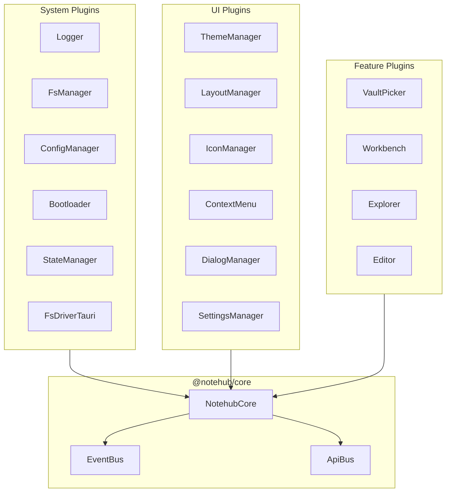

# Комплексный аудит проекта Notehub.md

> **Дата:** 2026-01-04  
> **Версия проекта:** 0.1.0  
> **Область анализа:** Архитектура, код, баги, UX, текущее состояние

---

## Executive Summary

| Аспект | Оценка | Комментарий |
|--------|--------|-------------|
| **Архитектура** | **B+** | Микроядро, хорошая модульность, явные контракты |
| **Качество кода** | **B-** | Документирован, но есть технический долг |
| **Плагины** | **B** | 19+ плагинов, чёткое разделение ответственности |
| **UX/UI** | **C+** | Функционально, но требует polish |
| **Производительность** | **C** | Оптимистичный UI, но нет виртуализации |
| **Тестирование** | **D** | Отсутствие unit/integration тестов |
| **Документация** | **B-** | README + plugin docs, но устаревает |
| **Общая оценка** | **C+/B-** | Solid foundation with room for improvement |

### Ключевые достоинства проекта
- ✅ Микроядерная архитектура с чистым разделением
- ✅ Type-safe API контракт (`NotehubApiMap`)
- ✅ Event-driven коммуникация между плагинами
- ✅ Tauri V2 интеграция для desktop
- ✅ Dynamic plugin loading с dependency resolution
- ✅ Optimistic UI updates в Explorer

### Критические области для улучшения
- ❌ Отсутствие автоматических тестов
- ❌ Нет виртуализации для больших деревьев
- ❌ Отсутствие персистентности UI-состояния
- ❌ Незавершённый feature set (search, multi-select, D&D)

---

## 1. Архитектурный анализ

### 1.1 Общая структура проекта

```
notehub.md/
├── apps/
│   └── desktop/              # Tauri V2 desktop app
│       ├── src/main.tsx      # Bootstrap + Dynamic plugin loading
│       └── src-tauri/        # Rust backend
├── packages/
│   ├── core/                 # @notehub/core - Микроядро
│   └── plugins/
│       ├── system/           # 6 системных плагинов
│       ├── ui/               # 9 UI плагинов
│       └── features/         # 4 фича-плагина
├── docs/ru/                  # Документация + отчёты
└── scripts/                  # CLI инструменты
```

**Общий объём:** ~15,000+ строк TypeScript

### 1.2 Микроядерная архитектура



### 1.3 Plugin Architecture - Положительные аспекты

| Паттерн | Реализация | Файл |
|---------|------------|------|
| **Явный API контракт** | ✅ Отлично | [contract.ts](file:///c:/Users/khton/sources/notehub.md/packages/core/src/api/contract.ts) |
| **Lifecycle management** | ✅ Хорошо | `load()` → `onReady()` → `unload()` |
| **Dependency resolution** | ✅ Хорошо | Bootloader с parallel loading |
| **Event-driven comm** | ✅ Хорошо | EventBus с async handlers |
| **Type-safe API calls** | ✅ Отлично | ApiBus с generics |

### 1.4 Архитектурные проблемы

#### 🟡 Проблема 1: Отсутствие Error Boundaries

**Файл:** [NotehubCore.ts:123-131](file:///c:/Users/khton/sources/notehub.md/packages/core/src/index.ts#L123-L131)

```typescript
for (const [id, plugin] of this.pluginRegistry) {
    try {
        await plugin.load(this);
    } catch (error) {
        console.error(`Failed to load plugin "${id}":`, error);
        throw error; // ← Останавливает всё приложение
    }
}
```

**Проблема:** Ошибка в одном плагине останавливает загрузку всех остальных.

**Рекомендация:** Использовать Bootloader's `result.failed` и продолжать с оставшимися плагинами.

---

#### 🟡 Проблема 2: ConfigManager использует Tauri Path API напрямую

**Файл:** [config-manager/index.ts:2](file:///c:/Users/khton/sources/notehub.md/packages/plugins/system/config-manager/src/index.ts#L2)

```typescript
import { appDataDir, join } from '@tauri-apps/api/path';
```

**Проблема:** 
- Связывает системный плагин с конкретной платформой
- Нарушает принцип platform abstraction
- Не будет работать в web-версии

**Рекомендация:** Добавить `path:*` API в fs-manager для абстракции платформенных путей.

---

#### 🟡 Проблема 3: Смешение синхронного и асинхронного API

**Файл:** [menus.ts:116-120](file:///c:/Users/khton/sources/notehub.md/packages/plugins/features/explorer/src/menus.ts#L116-L120)

```typescript
const unsubItem = app.api.invoke<() => void>(
    'context-menu:register' as any,  // ← as any подавляет типизацию
    ...
);

if (typeof unsubItem === 'function') { ... }  // ← Проверка типа вручную
```

**Проблема:**
- `as any` обходит TypeScript protection
- `invoke()` возвращает `Promise`, но код ожидает синхронный результат

---

## 2. Обнаруженные баги

### 🐛 Баг 1: Race condition при rename в ConfigManager

**Файл:** [config-manager/index.ts:89-92](file:///c:/Users/khton/sources/notehub.md/packages/plugins/system/config-manager/src/index.ts#L89-L92)

```typescript
async unload(app: NotehubCore): Promise<void> {
    // Remove listeners
    if (this.app) {
        this.app.events.off('app:vault-opened', this.handleVaultOpened.bind(this));
        this.app.events.off('app:vault-closed', this.handleVaultClosed.bind(this));
    }
}
```

**Проблема:** `.bind(this)` создаёт новую функцию при каждом вызове. `off()` не найдёт оригинальный handler, listener не будет удалён.

**Исправление:**
```typescript
// В конструкторе или load():
private handleVaultOpenedBound = this.handleVaultOpened.bind(this);

// При подписке:
this.app.events.on('app:vault-opened', this.handleVaultOpenedBound);

// При отписке:
this.app.events.off('app:vault-opened', this.handleVaultOpenedBound);
```

---

### 🐛 Баг 2: Memory leak в theme-manager при смене темы

**Файл:** [theme-manager/index.ts:412-432](file:///c:/Users/khton/sources/notehub.md/packages/plugins/ui/theme-manager/src/index.ts#L412-L432)

```typescript
app.events.on('config:updated', async (payload: any) => {
    if (payload.key === 'theme.accent-primary') {
        // ...
    }
});
```

**Проблема:** Event listener создаётся в `load()`, но не удаляется в `unload()`. При hot-reload плагина накапливаются дублирующиеся listeners.

---

### 🐛 Баг 3: NodeRow авто-открывает файл при любом фокусе

**Файл:** [NodeRow.tsx:42-47](file:///c:/Users/khton/sources/notehub.md/packages/plugins/features/explorer/src/components/NodeRow.tsx#L42-L47)

```typescript
useEffect(() => {
    if (node.isFocused && !data.isDir && !node.isEditing) {
        app.events.emit('explorer:file-selected', { path: data.id });
    }
}, [node.isFocused, data.isDir, data.id, node.isEditing, app.events]);
```

**Проблема:** При навигации стрелками каждый файл автоматически открывается в редакторе. Это может быть нежелательно и создаёт лишние операции чтения.

**Ожидаемое поведение:** Открывать файл только по Enter или двойному клику.

---

### 🐛 Баг 4: Отсутствие дедупликации в context-menu:register

**Файл:** [menus.ts](file:///c:/Users/khton/sources/notehub.md/packages/plugins/features/explorer/src/menus.ts)

При каждом вызове `registerExplorerMenus()` регистрируются новые провайдеры. Если плагин перезагружается без вызова cleanup, меню дублируется.

---

### 🐛 Баг 5: Потенциальная потеря данных при быстром переключении файлов

**Файл:** [EditorController.ts:470-472](file:///c:/Users/khton/sources/notehub.md/packages/plugins/features/editor/src/logic/EditorController.ts#L470-L472)

```typescript
this.saveTimeoutId = setTimeout(() => {
    this.saveFile();
}, this.SAVE_DEBOUNCE_MS);
```

**Сценарий:**
1. Пользователь редактирует файл A
2. Debounce timer запущен (1 сек)
3. Пользователь открывает файл B до срабатывания таймера
4. `openFile()` не отменяет pending save для A

**Проблема:** При быстром переключении возможна ситуация, когда save отправится для неправильного файла.

---

### 🐛 Баг 6: Windows path handling в getParentPath

**Файл:** [pathUtils.ts:18-21](file:///c:/Users/khton/sources/notehub.md/packages/plugins/features/explorer/src/logic/pathUtils.ts#L18-L21)

```typescript
export function getParentPath(path: string): string {
    const normalized = normalizePath(path);
    const lastSlash = normalized.lastIndexOf('/');
    return lastSlash > 0 ? normalized.substring(0, lastSlash) : '';
}
```

**Edge case:** Для путей типа `C:/folder` результат будет `C:`, что невалидно на Windows (должно быть `C:/`).

---

## 3. Оценка плагинов

### 3.1 System Plugins

| Плагин | Качество | Проблемы |
|--------|----------|----------|
| **Logger** | ✅ B+ | Простой, работает |
| **FsManager** | ✅ B | Хорошая абстракция, но нет path API |
| **FsDriverTauri** | ✅ B+ | Корректная V2 интеграция |
| **ConfigManager** | ⚠️ C+ | Memory leak, platform coupling |
| **StateManager** | ✅ B | Простой key-value store |
| **Bootloader** | ✅ B+ | Parallel loading, dep resolution |

### 3.2 UI Plugins

| Плагин | Качество | Проблемы |
|--------|----------|----------|
| **ThemeManager** | ✅ B | System theme + accent color, memory leak |
| **LayoutManager** | ✅ B | Zone system работает |
| **IconManager** | ✅ B+ | Lucide integration |
| **ContextMenu** | ✅ B- | Работает, но API не типизирован |
| **DialogManager** | ✅ B | Alert/Confirm/Prompt |
| **SettingsManager** | ✅ B | Declarative settings UI |
| **CkStandard** | ✅ B | Component Kit |
| **ControllersManager** | ✅ B | Controller registry |

### 3.3 Feature Plugins

| Плагин | Качество | Проблемы |
|--------|----------|----------|
| **VaultPicker** | ✅ B | Auto-open last vault |
| **Workbench** | ✅ B- | Layout coordination |
| **Explorer** | ⚠️ C+ | Много UX debt, см. предыдущие аудиты |
| **Editor** | ✅ B | CodeMirror 6, debounced save |

---

## 4. Архитектурные решения: Оценка

### 4.1 Положительные решения

#### ✅ Решение: Type-safe API Contract

```typescript
// contract.ts - Единый источник правды для API
export interface NotehubApiMap {
    'fs:read-text-file': (path: string) => Promise<string>;
    'config:get': <T = unknown>(key: string, def?: T) => T | undefined;
    // 60+ методов...
}
```

**Оценка:** Отлично. Обеспечивает type safety при invoke/register. IntelliSense работает.

---

#### ✅ Решение: EventBus с Promise.allSettled

```typescript
async emit<K extends keyof TEvents>(event: K, payload?: TEvents[K]): Promise<void> {
    const results = await Promise.allSettled(
        Array.from(callbacks).map(cb => Promise.resolve(cb(payload)))
    );
    // Log errors but don't throw
}
```

**Оценка:** Отлично. Один failing handler не ломает остальных.

---

#### ✅ Решение: Optimistic UI в Explorer

```typescript
// Optimistic update BEFORE fs operation
parentNode.children = parentNode.children.filter(c => c.id !== path);
this.notify();

// Async FS operation
await this.app.api.invoke('fs:remove-file', path);
```

**Оценка:** Хорошо. UI мгновенный, rollback при ошибке.

---

### 4.2 Сомнительные решения

#### ⚠️ Решение: React Context для Core

```typescript
// NotehubContext.ts
const NotehubContext = createContext<NotehubCore | null>(null);

export function useNotehub(): NotehubCore {
    const core = useContext(NotehubContext);
    if (!core) throw new Error('...');
    return core;
}
```

**Проблема:** Каждый компонент получает доступ ко всему ядру. Нет granular subscriptions.

**Альтернатива:** Zustand/Jotai для reactive state slices.

---

#### ⚠️ Решение: Inline Tailwind в компонентах

```tsx
<div className="flex items-center justify-between px-3 py-2 border-b 
    border-[var(--nh-border-subtle)] bg-[var(--nh-bg-secondary)]">
```

**Проблема:** 
- Смешение Tailwind и CSS variables
- Длинные className строки
- Дублирование стилей

**Рекомендация:** CSS modules или styled-components для компонентов с complex styling.

---

## 5. Текущий feature gap (vs Obsidian)

| Функция | Notehub | Obsidian | Приоритет |
|---------|---------|----------|-----------|
| Basic CRUD | ✅ | ✅ | - |
| Markdown preview | ✅ Live | ✅ Split/Live | - |
| File tree | ✅ Basic | ✅ Full | - |
| Drag & Drop | ❌ | ✅ | P1 |
| Search in vault | ❌ | ✅ | P0 |
| Backlinks | ❌ | ✅ | P2 |
| Tags | ❌ | ✅ | P2 |
| Graph view | ❌ | ✅ | P3 |
| Plugins API | ❌ | ✅ | P2 |
| Mobile | ❌ | ✅ | P3 |
| Sync | ❌ | ✅ Premium | P3 |
| Templates | ❌ | ✅ | P2 |
| Daily notes | ❌ | ✅ | P2 |

---

## 6. Рекомендации по улучшению

### Приоритет P0 (Критично)

| # | Задача | Effort | Impact |
|---|--------|--------|--------|
| 1 | Добавить unit тесты для core | L | Critical |
| 2 | Реализовать vault search | L | High |
| 3 | Исправить memory leaks в ConfigManager/ThemeManager | M | High |
| 4 | Добавить path API в fs-manager | M | Medium |

### Приоритет P1 (Важно)

| # | Задача | Effort | Impact |
|---|--------|--------|--------|
| 5 | Drag & Drop в Explorer | L | High |
| 6 | Виртуализация дерева (react-window) | M | High |
| 7 | Persist expanded folders | S | Medium |
| 8 | Типизировать context-menu API | M | Medium |

### Приоритет P2 (Желательно)

| # | Задача | Effort | Impact |
|---|--------|--------|--------|
| 9 | Multi-select в Explorer | L | Medium |
| 10 | Backlinks panel | L | Medium |
| 11 | Templates system | M | Medium |
| 12 | Daily notes | S | Low |

---

## 7. Метрики качества кода

### 7.1 Статистика по файлам

| Компонент | Файлов | LOC | Комментариев |
|-----------|--------|-----|--------------|
| Core | 7 | ~900 | ~30% |
| System plugins | 18 | ~2000 | ~20% |
| UI plugins | 30 | ~3500 | ~15% |
| Feature plugins | 25 | ~4500 | ~20% |
| Desktop app | 5 | ~500 | ~5% |

### 7.2 Зависимости

```
@notehub/core → 0 external deps (pure)
@notehub/bootloader → @notehub/core
@notehub/fs-manager → @notehub/core
@notehub/editor → codemirror, @lezer/*, react
@notehub/explorer → react-arborist, react-dnd
@notehub/theme-manager → colord
```

**Оценка:** Зависимости минимальны, core изолирован.

---

## 8. Заключение

### Общая оценка проекта: **C+/B-**

**Notehub.md** — это хорошо спроектированное приложение с чистой микроядерной архитектурой. Фундамент (ядро, шины, плагин-система) реализован качественно. Однако проект находится на ранней стадии развития с заметным feature gap относительно конкурентов.

### Сильные стороны
1. **Архитектура** — Микроядро с явными контрактами, параллельная загрузка плагинов
2. **Type safety** — Строгая типизация API через centralized contract
3. **Modularity** — Чёткое разделение на system/ui/features
4. **Modern stack** — Tauri V2, CodeMirror 6, React 18

### Области для роста
1. **Testing** — Критический пробел, нужны unit и integration тесты
2. **Search** — Must-have feature для note-taking app
3. **Performance** — Виртуализация для масштабирования
4. **UX Polish** — Explorer нуждается в доработке (см. отдельные аудиты)

### Roadmap рекомендации

**Phase 1 (1-2 недели):**
- Исправить обнаруженные баги
- Добавить базовые unit тесты
- Реализовать vault search

**Phase 2 (2-4 недели):**
- Drag & Drop в Explorer
- Виртуализация дерева
- Backlinks panel

**Phase 3 (1-2 месяца):**
- Templates
- Daily notes
- Plugin marketplace prep

---

> **Связанные аудиты:**
> - [2026-01-03 Explorer Code Review](file:///c:/Users/khton/sources/notehub.md/docs/ru/reports/2026-01-03-explorer-code-review.md)
> - [2026-01-01 Explorer Audit](file:///c:/Users/khton/sources/notehub.md/docs/ru/reports/2026-01-01-explorer-audit.md)
> - [2024-12-25 Global Audit](file:///c:/Users/khton/sources/notehub.md/docs/ru/reports/2024-12-25-global-audit.md)
