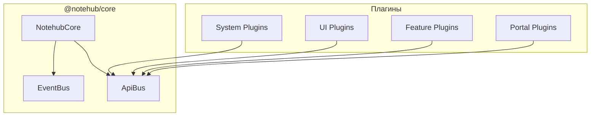
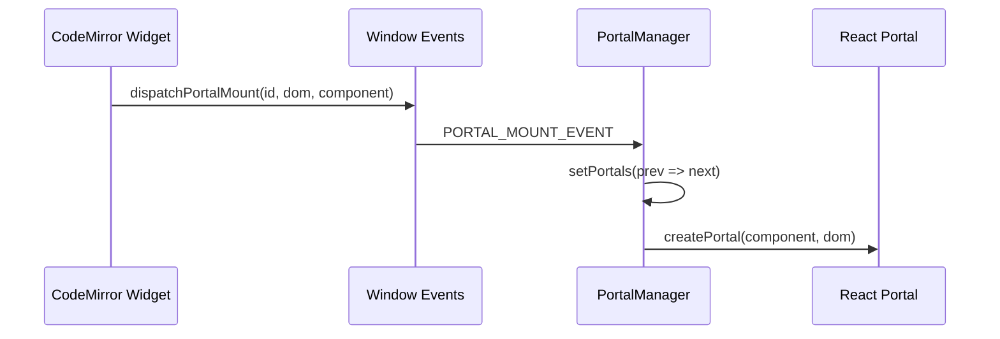

# Код-ревью Notehub.md

> **Дата:** 29 декабря 2025  
> **Версия:** 0.1.0  
> **Область:** Полный обзор архитектуры и реализации

---

## 1. Общий обзор архитектуры

Notehub.md построен на **микрокернельной архитектуре** с плагинной системой. Ядро предоставляет минимальный набор инфраструктуры, а вся бизнес-логика реализована через плагины.



### Сильные стороны

- ✅ **Чёткое разделение ответственности** — каждый плагин выполняет одну задачу
- ✅ **Типобезопасный API контракт** — `NotehubApiMap` в `contract.ts`
- ✅ **Жизненный цикл плагинов** — `load()`, `onReady()`, `unload()`
- ✅ **Изоляция ошибок** — `Promise.allSettled` в EventBus

### Рекомендации

- ⚠️ Использование `any` в интерфейсе `IPlugin` для параметра `app` — рассмотреть generic-подход
- ⚠️ Глобальная переменная `coreInstance` в `main.tsx` — потенциальный источник проблем

---

## 2. Ядро системы (@notehub/core)

### 2.1 NotehubCore

**Файл:** [`packages/core/src/index.ts`](file:///c:/Users/khton/sources/notehub.md/packages/core/src/index.ts)

```typescript
export class NotehubCore<TEvents extends EventMap = EventMap> {
    public readonly events: EventBus<TEvents>;
    public readonly api: ApiBus;
    private pluginRegistry: Map<string, IPlugin> = new Map();
}
```

| Аспект | Оценка | Комментарий |
|--------|--------|-------------|
| Дизайн | ⭐⭐⭐⭐⭐ | Чистый микрокернель с двумя шинами |
| Типизация | ⭐⭐⭐⭐ | Generic для событий, но `any` в IPlugin |
| Документация | ⭐⭐⭐⭐⭐ | JSDoc с примерами |

### 2.2 EventBus

**Файл:** [`packages/core/src/buses/EventBus.ts`](file:///c:/Users/khton/sources/notehub.md/packages/core/src/buses/EventBus.ts)

```typescript
async emit<K extends keyof TEvents>(event: K, payload?: TEvents[K]): Promise<void> {
    const results = await Promise.allSettled(
        Array.from(callbacks).map(cb => Promise.resolve(cb(payload)))
    );
}
```

> [!TIP]
> Использование `Promise.allSettled` — отличное решение для изоляции ошибок между обработчиками.

**Проблема:** Метод `once()` создаёт замыкание `onceWrapper`, но не возвращает функцию для ручной отписки.

### 2.3 ApiBus

**Файл:** [`packages/core/src/buses/ApiBus.ts`](file:///c:/Users/khton/sources/notehub.md/packages/core/src/buses/ApiBus.ts)

Типобезопасный реестр API с перегрузками:

```typescript
register<K extends ApiMethodName>(
    name: K,
    handler: (...args: ApiMethodArgs<K>) => ReturnType<NotehubApiMap[K]>
): void;

async invoke<K extends ApiMethodName>(
    method: K,
    ...args: ApiMethodArgs<K>
): Promise<ApiMethodAwaitedResult<K>>;
```

| Аспект | Оценка |
|--------|--------|
| Type Safety | ⭐⭐⭐⭐⭐ |
| Расширяемость | ⭐⭐⭐⭐ |
| Защита от дубликатов | ⭐⭐⭐⭐⭐ |

> [!IMPORTANT]
> API контракт в [`contract.ts`](file:///c:/Users/khton/sources/notehub.md/packages/core/src/api/contract.ts) — "конституция" экосистемы. Все 30+ методов типизированы.

---

## 3. Система плагинов

### 3.1 Bootloader

**Файл:** [`packages/plugins/system/bootloader/src/index.ts`](file:///c:/Users/khton/sources/notehub.md/packages/plugins/system/bootloader/src/index.ts)

Bootloader обеспечивает:
- **Топологическую сортировку** зависимостей
- **Параллельную загрузку** волнами
- **Отслеживание результатов** (loaded, failed, skipped)

```typescript
const result = await bootloader.load(loadablePlugins);
// result: { loaded, failed, skipped, waves }
```

> [!NOTE]
> Bootloader сам является плагином — элегантное решение "bootstrap problem".

### 3.2 Manifest Schema

```typescript
interface PluginManifest {
    id: string;           // "nh.system.logger"
    name: string;         // "Logger"
    version: string;      // "0.1.0"
    type: PluginType;     // 'system' | 'ui' | 'feature'
    dependencies?: string[];
}
```

**Конвенция именования:** `nh.<type>.<name>` — хорошая практика.

---

## 4. Система порталов (Portal Bridge)

### 4.1 Архитектура

Порталы решают проблему интеграции React-компонентов в CodeMirror через `createPortal`.



### 4.2 PortalManager

**Файл:** [`packages/plugins/features/editor/src/bridge/PortalManager.tsx`](file:///c:/Users/khton/sources/notehub.md/packages/plugins/features/editor/src/bridge/PortalManager.tsx)

```typescript
export interface PortalManagerAPI {
    mount(id: string, dom: HTMLElement, component: ReactNode): void;
    unmount(id: string): void;
    has(id: string): boolean;
}
```

| Аспект | Оценка | Комментарий |
|--------|--------|-------------|
| Декаплинг | ⭐⭐⭐⭐⭐ | CM и React полностью независимы |
| Performance | ⭐⭐⭐⭐ | `useMemo` для API, но `new Map()` на каждый mount |
| Cleanup | ⭐⭐⭐⭐⭐ | Автоматическая отписка в useEffect |

> [!WARNING]
> Использование `window.dispatchEvent` — глобальное состояние. Рассмотреть WeakMap или Context для изоляции нескольких редакторов.

### 4.3 BridgeWidget

**Файл:** [`packages/plugins/features/editor/src/bridge/BridgeWidget.ts`](file:///c:/Users/khton/sources/notehub.md/packages/plugins/features/editor/src/bridge/BridgeWidget.ts)

Абстрактный базовый класс для виджетов:

```typescript
export abstract class BridgeWidget extends WidgetType {
    protected abstract renderComponent(): ReactNode;
    
    toDOM(): HTMLElement {
        this.portalId = generatePortalId('widget');
        dispatchPortalMount(this.portalId, this.container, this.renderComponent());
        return this.container;
    }
    
    destroy(): void {
        dispatchPortalUnmount(this.portalId);
    }
}
```

**Достоинства:**
- Инкапсуляция жизненного цикла портала
- Простой API для создания виджетов

**Улучшения:**
- Добавить `updateDOM()` для обновления без пересоздания

---

## 5. CodeMirror 6 Integration

### 5.1 Live Preview ViewPlugin

**Файл:** [`packages/plugins/features/editor/src/cm/view-plugin.ts`](file:///c:/Users/khton/sources/notehub.md/packages/plugins/features/editor/src/cm/view-plugin.ts)

```typescript
class LivePreviewPluginValue implements PluginValue {
    decorations: DecorationSet;
    
    update(update: ViewUpdate): void {
        if (update.docChanged || update.selectionSet) {
            this.decorations = this.buildDecorations(update.view);
        }
    }
}
```

| Аспект | Оценка | Комментарий |
|--------|--------|-------------|
| Cursor-awareness | ⭐⭐⭐⭐⭐ | Показ raw-текста при редактировании |
| Performance | ⭐⭐⭐ | Полный rescan при каждом изменении |
| Atomic Ranges | ⭐⭐⭐⭐⭐ | Правильная навигация курсора |

#### Потенциальная оптимизация

```diff
- const docText = view.state.doc.toString();
+ // Использовать инкрементальное обновление через RangeSetBuilder
+ // для больших документов
```

> [!CAUTION]
> При больших документах (>10K строк) полный rescan через регулярное выражение может вызвать задержки.

### 5.2 NotehubEditor Component

**Файл:** [`packages/plugins/features/editor/src/components/NotehubEditor.tsx`](file:///c:/Users/khton/sources/notehub.md/packages/plugins/features/editor/src/components/NotehubEditor.tsx)

```typescript
const state = EditorState.create({
    doc: initialContent,
    extensions: [
        lineNumbers(),
        highlightActiveLine(),
        history(),
        keymap.of([...defaultKeymap, ...historyKeymap]),
        syntaxHighlighting(defaultHighlightStyle),
        editorTheme,
        livePreviewExtension,
        EditorView.updateListener.of(handleUpdate)
    ]
});
```

**Инъекция стилей:**
```typescript
if (!document.getElementById('nh-editor-styles')) {
    const styleEl = document.createElement('style');
    styleEl.id = 'nh-editor-styles';
    document.head.appendChild(styleEl);
}
```

> [!NOTE]
> Идемпотентная инъекция стилей — хорошая практика для избежания дублирования.

---

## 6. UI Система

### 6.1 Layout Manager

**Файл:** [`packages/plugins/ui/layout-manager/src/index.tsx`](file:///c:/Users/khton/sources/notehub.md/packages/plugins/ui/layout-manager/src/index.tsx)

Zone-based architecture:

```typescript
// Регистрация компонента в зоне
app.api.invoke('zone:register', 'sidebar-left', {
    component: 'explorer-tree',
    priority: 100
});

// Рендеринг зоны
<ZoneRenderer name="sidebar-left" />
```

| Аспект | Оценка |
|--------|--------|
| Гибкость | ⭐⭐⭐⭐⭐ |
| React Integration | ⭐⭐⭐⭐⭐ (useSyncExternalStore) |
| Приоритизация | ⭐⭐⭐⭐ |

### 6.2 Controllers Manager

**Файл:** [`packages/plugins/ui/controllers-manager/src/index.tsx`](file:///c:/Users/khton/sources/notehub.md/packages/plugins/ui/controllers-manager/src/index.tsx)

```typescript
// Singleton pattern для доступа из Controller компонента
let controllerRegistryInstance: Map<string, React.FC<any>> | null = null;

export const Controller: FC<ControllerProps> = ({ type, ...props }) => {
    const ControllerComponent = controllerRegistryInstance?.get(type);
    return ControllerComponent ? <ControllerComponent {...props} /> : null;
};
```

> [!WARNING]
> Module-level singleton может вызвать проблемы при SSR или тестировании. Рассмотреть Context API.

### 6.3 Theme Manager

**Файл:** [`packages/plugins/ui/theme-manager/src/index.ts`](file:///c:/Users/khton/sources/notehub.md/packages/plugins/ui/theme-manager/src/index.ts)

CSS Variables подход:

```typescript
applyTheme(palette: ThemePalette): void {
    for (const [key, value] of Object.entries(palette)) {
        document.documentElement.style.setProperty(`--nh-${key}`, value);
    }
}
```

**Преимущества:**
- Мгновенное переключение тем
- Совместимость с CodeMirror через CSS variables
- Сохранение предпочтений через config-manager

---

## 7. Feature Plugins

### 7.1 Editor Plugin

**Файл:** [`packages/plugins/features/editor/src/index.tsx`](file:///c:/Users/khton/sources/notehub.md/packages/plugins/features/editor/src/index.tsx)

```typescript
// Auto-save с debounce
saveTimeoutRef.current = setTimeout(() => {
    saveFile(path, newContent);
}, 500);
```

| Аспект | Оценка | Комментарий |
|--------|--------|-------------|
| Auto-save | ⭐⭐⭐⭐⭐ | 500ms debounce |
| Loading state | ⭐⭐⭐⭐ | `isLoadingRef` для предотвращения ложных сохранений |
| Event cleanup | ⭐⭐⭐⭐⭐ | Правильная отписка в useEffect |

### 7.2 Explorer Plugin

**Файл:** [`packages/plugins/features/explorer/src/index.tsx`](file:///c:/Users/khton/sources/notehub.md/packages/plugins/features/explorer/src/index.tsx)

Образцовая реализация lifecycle hygiene:

```typescript
private eventCleanups: Array<() => void> = [];

async load(app: NotehubCore): Promise<void> {
    app.events.on('explorer:open', openHandler);
    this.eventCleanups.push(() => app.events.off('explorer:open', openHandler));
}

async unload(app: NotehubCore): Promise<void> {
    for (const cleanup of this.eventCleanups) {
        cleanup();
    }
}
```

---

## 8. Рекомендации по улучшению

### Критические (High Priority)

| # | Проблема | Решение |
|---|----------|---------|
| 1 | Глобальный `coreInstance` | Использовать Context API исключительно |
| 2 | `window.dispatchEvent` для порталов | WeakMap с EditorView как ключом |
| 3 | Full document rescan в Live Preview | Инкрементальное обновление через RangeSetBuilder |

### Средний приоритет

| # | Проблема | Решение |
|---|----------|---------|
| 4 | `any` в IPlugin.load() | Generic или branded types |
| 5 | Module-level singletons | Dependency Injection через Context |
| 6 | Отсутствие `updateDOM()` в BridgeWidget | Добавить метод для частичного обновления |

### Низкий приоритет

| # | Проблема | Решение |
|---|----------|---------|
| 7 | Жёсткий switch в `importPlugin()` | Динамический import с manifest-driven подходом |
| 8 | Inline стили в компонентах | Consolidate в CSS modules или Tailwind |

---

## 9. Метрики качества кода

| Метрика | Значение | Оценка |
|---------|----------|--------|
| Типизация | ~95% | ⭐⭐⭐⭐⭐ |
| Документация (JSDoc) | ~80% | ⭐⭐⭐⭐ |
| Консистентность API | Высокая | ⭐⭐⭐⭐⭐ |
| Error Handling | Хорошее | ⭐⭐⭐⭐ |
| Test Coverage | Неизвестно | ❓ |

---

## 10. Заключение

Notehub.md демонстрирует **зрелую архитектуру** с чётким разделением ответственности. Ключевые достижения:

1. **Микрокернельный дизайн** — минимальное ядро, максимальная расширяемость
2. **Portal Bridge** — элегантное решение для React-интеграции в CodeMirror
3. **Type-safe API контракт** — единый источник истины для всех API
4. **Zone-based layouts** — гибкая UI композиция

Основные области для улучшения связаны с **устранением глобального состояния** и **оптимизацией производительности** для больших документов.

---

> *Документ подготовлен на основе анализа исходного кода версии 0.1.0*
