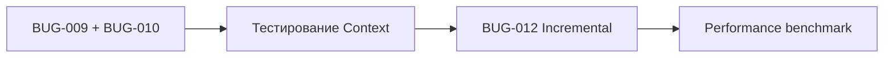

# Отложенные баги — Технический долг

> **Дата:** 29 декабря 2025  
> **Статус:** Требует архитектурных изменений

---

## Обзор

Три бага были отложены из-за высокого риска регрессий при исправлении. Они требуют рефакторинга core-паттернов и должны быть выполнены как отдельные PR с тщательным тестированием.

| Bug ID | Проблема | Сложность |
|--------|----------|-----------|
| BUG-009 | Singleton в ControllersManager | 🔴 Высокая |
| BUG-010 | Глобальный appInstance в LayoutManager | 🔴 Высокая |
| BUG-012 | Полный rescan в Live Preview | 🟠 Средняя |

---

## BUG-009: Singleton в ControllersManager

### Текущий код

**Файл:** [`controllers-manager/src/index.tsx:17`](file:///c:/Users/khton/sources/notehub.md/packages/plugins/ui/controllers-manager/src/index.tsx#L17)

```typescript
// Module-level singleton
let controllerRegistryInstance: Map<string, React.FC<any>> | null = null;

export class ControllersManagerPlugin implements IPlugin {
    private registry: Map<string, React.FC<any>> = new Map();

    async load(app: NotehubCore): Promise<void> {
        // Expose registry to module scope for Controller component
        controllerRegistryInstance = this.registry;
        // ...
    }
}

// Controller component accesses via module global
export const Controller: FC<ControllerProps> = ({ type, ...props }) => {
    const ControllerComponent = controllerRegistryInstance?.get(type);
    return ControllerComponent ? <ControllerComponent {...props} /> : null;
};
```

### Проблемы

1. **HMR проблемы**: При hot reload singleton сохраняет старые компоненты
2. **Тестирование**: Невозможно изолировать тесты — registry shared между тестами
3. **SSR несовместимость**: При серверном рендеринге singleton создаётся один раз на все запросы
4. **Multiple instances**: Если создать >1 NotehubCore, все будут разделять один registry

### Решение: Context API

```typescript
// 1. Создать Context
const ControllersContext = createContext<Map<string, React.FC<any>> | null>(null);

// 2. Provider в plugin
export const ControllersProvider: FC<PropsWithChildren<{ registry: Map<...> }>> = 
    ({ registry, children }) => (
        <ControllersContext.Provider value={registry}>
            {children}
        </ControllersContext.Provider>
    );

// 3. Controller использует Context
export const Controller: FC<ControllerProps> = ({ type, ...props }) => {
    const registry = useContext(ControllersContext);
    const Component = registry?.get(type);
    return Component ? <Component {...props} /> : null;
};

// 4. Интеграция в host app
<NotehubProvider app={core}>
    <ControllersProvider registry={controllersPlugin.getRegistry()}>
        <LayoutRenderer />
    </ControllersProvider>
</NotehubProvider>
```

### План изменений

| # | Файл | Изменение |
|---|------|-----------|
| 1 | `controllers-manager/src/index.tsx` | Добавить `ControllersContext`, `ControllersProvider` |
| 2 | `controllers-manager/src/index.tsx` | Убрать `controllerRegistryInstance` |
| 3 | `@notehub/core` | Добавить экспорт `ControllersProvider` |
| 4 | `desktop/src/main.tsx` | Обернуть root в `ControllersProvider` |
| 5 | Все layout компоненты | Проверить, что Controller работает |

### Риски

- ⚠️ Требует изменения в host app (`main.tsx`)
- ⚠️ Все плагины с Controller должны быть протестированы
- ⚠️ Breaking change для кастомных интеграций

---

## BUG-010: Глобальный appInstance в LayoutManager

### Текущий код

**Файл:** [`layout-manager/src/index.tsx:99`](file:///c:/Users/khton/sources/notehub.md/packages/plugins/ui/layout-manager/src/index.tsx#L99)

```typescript
// Module-level global
let appInstance: NotehubCore | null = null;

export class LayoutManagerPlugin implements IPlugin {
    async load(app: NotehubCore): Promise<void> {
        this.app = app;
        appInstance = app; // ← Глобальная переменная
        // ...
    }
}

export const LayoutRenderer: FC = () => {
    // ... 
    // Injects app into layout component
    return <Component {...currentLayout.props} app={appInstance} />;
};
```

### Проблемы

Идентичны BUG-009:
- HMR zombies
- Test isolation impossible
- Single instance assumption

### Решение: Использовать существующий NotehubContext

```typescript
// LayoutRenderer уже находится внутри NotehubProvider
// Можно использовать useNotehub() вместо appInstance

export const LayoutRenderer: FC = () => {
    const app = useNotehub();
    const currentLayout = useSyncExternalStore(...);
    
    if (!currentLayout) return null;
    const Component = layoutRegistry.get(currentLayout.name);
    
    // Pass app via props or let layout use useNotehub()
    return <Component {...currentLayout.props} />;
};

// В layout компонентах:
export const EditorLayout: React.FC<EditorLayoutProps> = (props) => {
    const app = useNotehub(); // ← Вместо props.app
    // ...
};
```

### План изменений

| # | Файл | Изменение |
|---|------|-----------|
| 1 | `layout-manager/src/index.tsx` | Убрать `appInstance` |
| 2 | `LayoutRenderer` | Убрать передачу `app` в props |
| 3 | `EditorLayout.tsx` | Использовать `useNotehub()` |
| 4 | `WelcomeLayout.tsx` | Использовать `useNotehub()` |

### Совместное решение с BUG-009

Оба бага можно решить в одном PR:

```tsx
// После рефакторинга (main.tsx)
<NotehubProvider app={core}>
    <LayoutRenderer />
</NotehubProvider>

// Все layout и controller компоненты используют:
const app = useNotehub();
```

---

## BUG-012: Полный rescan документа в Live Preview

### Текущий код

**Файл:** [`editor/src/cm/view-plugin.ts`](file:///c:/Users/khton/sources/notehub.md/packages/plugins/features/editor/src/cm/view-plugin.ts)

```typescript
class LivePreviewPluginValue implements PluginValue {
    decorations: DecorationSet;
    
    update(update: ViewUpdate): void {
        if (update.docChanged || update.selectionSet) {
            // ❌ Полный rescan на каждое изменение
            this.decorations = this.buildDecorations(update.view);
        }
    }

    private buildDecorations(view: EditorView): DecorationSet {
        const builder = new RangeSetBuilder<Decoration>();
        
        // ❌ Конвертирует весь док в строку
        const docText = view.state.doc.toString();
        
        // ❌ Регулярка по всему документу
        const patterns = findPatterns(docText);
        
        for (const match of patterns) {
            // ... build decorations
        }
        
        return builder.finish();
    }
}
```

### Проблемы

1. **O(n) на каждый keystroke**: На 10K строк — заметный лаг
2. **toString() копирует всю строку**: Memory pressure
3. **Не использует incremental updates**: CM6 поддерживает RangeSet.map()

### Профилирование

| Размер документа | toString() | Regex scan | Total |
|------------------|------------|------------|-------|
| 100 строк | <1ms | <1ms | ~2ms |
| 1000 строк | ~2ms | ~5ms | ~7ms |
| 10000 строк | ~15ms | ~40ms | ~55ms ⚠️ |

При 60 FPS допустимо ~16ms на кадр. 55ms = заметный лаг.

### Решение: Инкрементальное обновление

```typescript
class LivePreviewPluginValue implements PluginValue {
    decorations: DecorationSet;
    
    update(update: ViewUpdate): void {
        if (!update.docChanged && !update.selectionSet) {
            return; // Ничего не делать
        }
        
        if (update.docChanged) {
            // Используем map для обновления позиций существующих декораций
            this.decorations = this.decorations.map(update.changes);
            
            // Пересканировать только изменённые регионы
            update.changes.iterChangedRanges((fromA, toA, fromB, toB) => {
                this.rescanRange(update.view, fromB, toB);
            });
        }
        
        if (update.selectionSet) {
            // Cursor-aware логика — только для видимой области
            this.updateCursorAwareness(update.view);
        }
    }

    private rescanRange(view: EditorView, from: number, to: number): void {
        // Расширить до границ строк
        const fromLine = view.state.doc.lineAt(from);
        const toLine = view.state.doc.lineAt(to);
        
        // Сканировать только этот диапазон
        const text = view.state.doc.sliceString(fromLine.from, toLine.to);
        // ... find patterns in text with offset adjustment
    }
}
```

### План изменений

| # | Файл | Изменение |
|---|------|-----------|
| 1 | `view-plugin.ts` | Добавить `decorations.map(update.changes)` |
| 2 | `view-plugin.ts` | Реализовать `rescanRange()` |
| 3 | `view-plugin.ts` | Оптимизировать cursor-awareness для viewport |
| 4 | Тесты | Добавить performance benchmark |

### Риски

- ⚠️ Offset calculation сложнее для incremental
- ⚠️ Edge cases с multi-line patterns
- ⚠️ Нужно тестировать на больших документах

---

## Рекомендуемый порядок



1. **PR #1**: BUG-009 + BUG-010 вместе (связанные проблемы)
2. **PR #2**: BUG-012 отдельно (performance-focused)

---

## Оценка трудозатрат

| Bug | Часы разработки | Часы тестирования |
|-----|-----------------|-------------------|
| BUG-009 + BUG-010 | 4-6h | 2-3h |
| BUG-012 | 6-8h | 3-4h |
| **Итого** | **10-14h** | **5-7h** |

---

> *Документ подготовлен для планирования рефакторинга*
